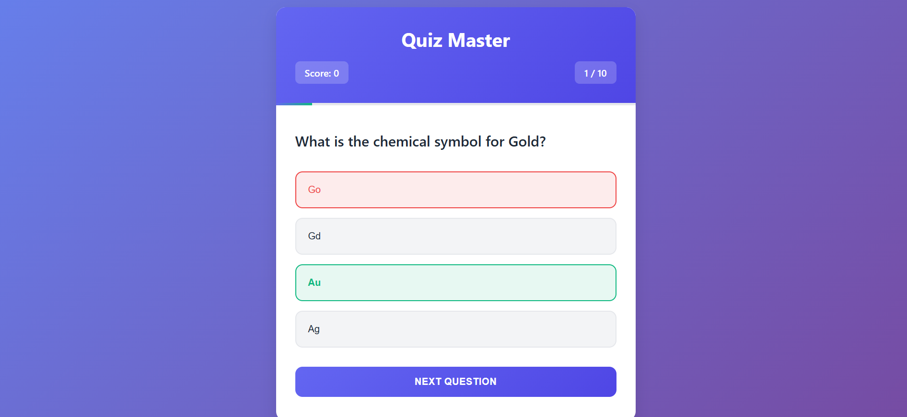
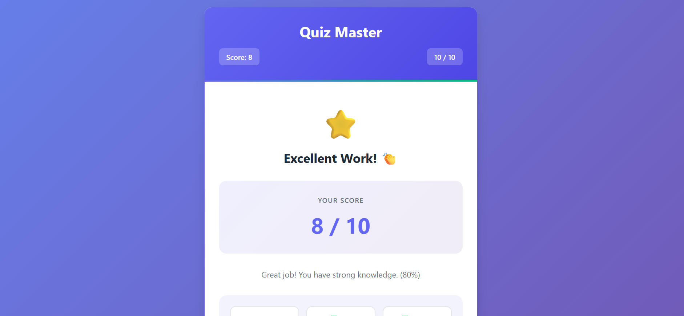
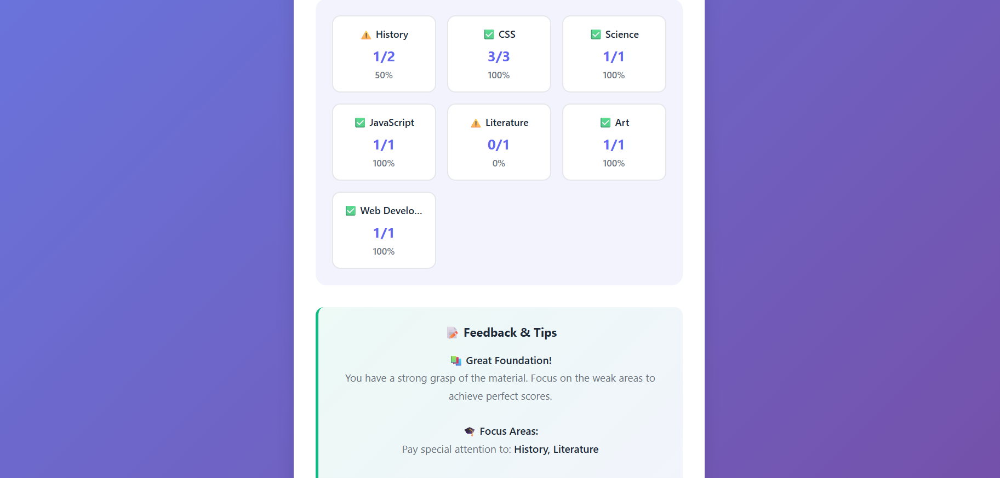
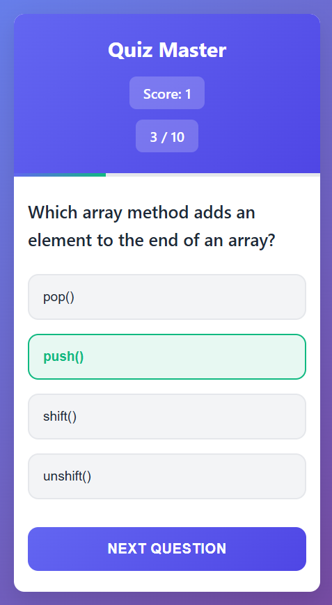

# Quiz Master

## Description

Quiz Master is an interactive, web-based quiz application designed to test and enhance users' knowledge across a variety of topics. Built with modern web technologies, this application provides an engaging and user-friendly experience for learning and self-assessment. The quiz features a diverse set of questions spanning multiple categories including Mathematics, Web Development, CSS, JavaScript, Geography, History, Science, Literature, and Art.

The application dynamically selects and shuffles 10 questions from a comprehensive question bank of 20 carefully crafted questions. Each quiz session is unique, ensuring that users can retake the quiz multiple times without encountering the same sequence of questions. Upon completion, users receive detailed feedback including their overall score, performance breakdown by category, and personalized tips for improvement.

Quiz Master emphasizes not just testing knowledge, but also learning through feedback. The results screen provides insights into strengths and weaknesses, helping users identify areas that need more attention. This makes it an excellent tool for students, professionals looking to refresh their knowledge, or anyone interested in self-paced learning.

## Features

### Core Functionality
- **Dynamic Question Selection**: Randomly selects 10 questions from a pool of 20 across multiple categories
- **Real-time Scoring**: Tracks and displays the current score as users progress through the quiz
- **Progress Tracking**: Visual progress bar and question counter keep users informed of their advancement
- **Instant Feedback**: Immediate visual feedback on answer selections with correct/incorrect highlighting
- **Comprehensive Results**: Detailed results screen with percentage scores and performance messages

### Advanced Features
- **Category-wise Analysis**: Breakdown of performance by subject category with visual indicators
- **Personalized Feedback**: Tailored tips and recommendations based on quiz performance
- **Responsive Design**: Optimized for both desktop and mobile devices
- **Smooth Animations**: Engaging transitions and animations for better user experience
- **Restart Functionality**: Easy option to retake the quiz and track improvement

### User Experience
- **Intuitive Interface**: Clean, modern design with clear navigation
- **Accessibility**: Proper contrast ratios and readable fonts
- **Performance Optimized**: Fast loading and smooth interactions
- **No External Dependencies**: Pure HTML, CSS, and JavaScript implementation

## Technologies Used

- **HTML5**: Semantic markup for structure and accessibility
- **CSS3**: Modern styling with custom properties, gradients, and animations
- **Vanilla JavaScript**: ES6+ features for interactive functionality
- **Responsive Design**: Media queries and flexible layouts

## Installation

### Prerequisites
- A modern web browser (Chrome, Firefox, Safari, Edge)
- No additional software or server required


## Usage

1. **Start the Quiz**
   - Open the application in your browser
   - The quiz begins automatically with the first question

2. **Answer Questions**
   - Read each question carefully
   - Click on your chosen answer
   - Receive immediate feedback (green for correct, red for incorrect)

3. **Navigate Through Quiz**
   - Click "Next Question" to proceed
   - Monitor your progress with the progress bar and score tracker

4. **Review Results**
   - View your final score and percentage
   - Analyze performance by category
   - Read personalized feedback and improvement tips

5. **Retake Quiz**
   - Click "Take Quiz Again" to restart with a new set of questions

## Screenshots

### Quiz Interface

*The main quiz interface showing a question with multiple choice answers and progress tracking.*

### Results Screen

*Comprehensive results display with score breakdown and personalized feedback.*

### Category Breakdown

*Detailed performance analysis by subject category.*

### Mobile View

*Responsive design optimized for mobile devices.*

## Project Structure

```
quiz-master/
├── index.html          # Main HTML structure
├── style.css           # Styling and responsive design
├── script.js           # Quiz logic and interactivity
└── README.md           # Project documentation
```

### File Descriptions
- **index.html**: Contains the semantic HTML structure, including quiz container, question display, answer buttons, progress elements, and results screen
- **style.css**: Defines the visual appearance with CSS custom properties, responsive breakpoints, and smooth animations
- **script.js**: Implements the quiz functionality including question management, scoring, feedback generation, and user interaction handling

## Contributing

We welcome contributions to improve Quiz Master! Here's how you can help:

### Ways to Contribute
- **Bug Reports**: Report issues or unexpected behavior
- **Feature Requests**: Suggest new features or improvements
- **Code Contributions**: Submit pull requests with enhancements
- **Question Bank Expansion**: Add more questions or categories
- **UI/UX Improvements**: Enhance the design and user experience

### Development Setup
1. Fork the repository
2. Create a feature branch: `git checkout -b feature/your-feature-name`
3. Make your changes
4. Test thoroughly in multiple browsers
5. Submit a pull request

### Guidelines
- Maintain code quality and readability
- Add comments for complex logic
- Test on multiple devices and browsers
- Follow existing code style and structure
- Update documentation as needed

## License

This project is licensed under the MIT License - see the [LICENSE](LICENSE) file for details.

## Future Enhancements

- **User Accounts**: Save progress and quiz history
- **Question Difficulty Levels**: Easy, Medium, Hard options
- **Timer Functionality**: Time-limited quizzes
- **Multi-language Support**: Internationalization
- **Question Import/Export**: Custom question sets
- **Social Features**: Share results and compete with friends
- **Offline Mode**: Service worker implementation
- **Accessibility Improvements**: Screen reader optimization

## Acknowledgments

- Question content inspired by common knowledge and programming concepts
- Design inspired by modern web application trends
- Built with passion for education and interactive learning

---

**Quiz Master** - Test your knowledge, track your progress, and learn something new every time!
